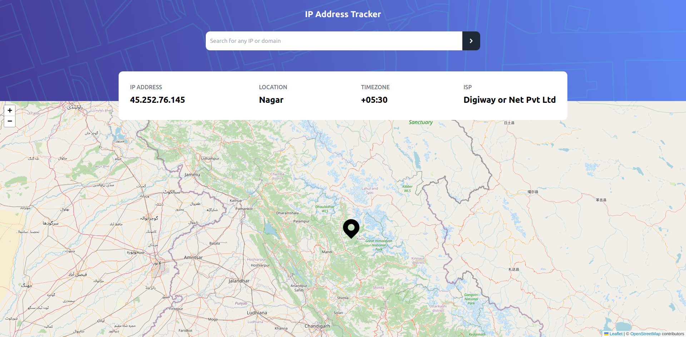

    <h1 align='center' >IP ADDRESS TRACKER</h1>
    

    
    

## Live Link 🚀

🔗 https://react-ip-address-tracker-mauve.vercel.app/

## 👨‍💻 About

- React app that uses IP Geolocation API and LeafletJS to display the details about an IP Address along with its location on the map.

## 🛠 Build with

- React js
- Tailwind css
- [IP Geolocation API](https://geo.ipify.org/)
- [React Leaflet](https://react-leaflet.js.org/)

## 🤝🏻 Connect With Me

